# Mandate

> **One authority layer. Many agents. Multiple markets.**  
> **Agents propose. Mandate authorizes. Markets settle.**

> [!IMPORTANT]
> **Public demo settlement disclaimer**
>
> The hosted demo at `https://mandateai.vercel.app` runs the full **live AI → multi-agent planning → Mandate Room → deterministic authorization → portfolio reservation** flow, but it does **not broadcast a new blockchain transaction from the public Railway server**.
>
> This is intentional and security-driven — **not a failed transaction and not a limitation of Mandate's settlement protocol**. The public API runs in `MANDATE_PUBLIC_DEMO=1`, which keeps settlement composition disabled with `PUBLIC_DEMO_WRITE_DISABLED`. We chose not to expose testnet signing/custody keys behind a public internet-facing endpoint during the final buildathon deployment window.
>
> The repository contains the separate Robinhood Chain testnet settlement implementation in `packages/live-settlement`, and Mandate has already executed confirmed valueless testnet transactions through its execution-gate path. Those historical onchain proofs are documented in [`docs/phase-7e/robinhood-demo.md`](docs/phase-7e/robinhood-demo.md).
>
> **So when the hosted UI shows `AUTHORIZED` / `Reserved is not settled`, no transaction has reverted — no transaction was constructed, signed, or broadcast in that hosted session.**


Mandate is an authorization and execution control plane for autonomous financial agents.

AI agents can already discover opportunities, compare markets, negotiate with one another, and generate transactions. The harder problem is deciding whether a particular action is actually inside the authority granted by the human or institution behind the agent.

A valid agent signature proves **who proposed an action**. It does not prove **that the action was permitted**.

Mandate separates those concerns.

```text
VALID AGENT != VALID ACTION
```

A principal defines bounded economic authority once. Agents then operate autonomously inside that boundary. Every proposed action is resolved against canonical asset identity, representation policy, market constraints, agent-local limits, portfolio-global limits, current state, replay state, and execution terms before it can reach settlement.

Mandate does not recommend investments. It enforces authority.

---

## Contents

- [Why Mandate exists](#why-mandate-exists)
- [The mental model](#the-mental-model)
- [What is implemented](#what-is-implemented)
- [Quick start](#quick-start)
- [Demo prompts](#demo-prompts)
- [The complete authority model](#the-complete-authority-model)
- [AI intelligence layer](#ai-intelligence-layer)
- [Agents](#agents)
- [Mandate Room](#mandate-room)
- [Jev / TypeSafe](#jev--typesafe)
- [How a live run works](#how-a-live-run-works)
- [Execution and settlement](#execution-and-settlement)
- [Security model](#security-model)
- [Evidence classes](#evidence-classes)
- [Architecture](#architecture)
- [Repository map](#repository-map)
- [Commands](#commands)
- [Deployment](#deployment)
- [Testing](#testing)
- [Known limitations](#known-limitations)
- [Design principles](#design-principles)

---

# Why Mandate exists

Most agent infrastructure answers one of these questions:

- Can the agent sign?
- Can the agent call a tool?
- Can the agent access a wallet?
- Can the transaction be submitted?
- Can the chain execute it?

Those questions are necessary, but they do not answer the economic question:

> **Was this exact action actually authorized by the principal?**

An agent may be authenticated and still attempt an invalid action:

- spend more capital than the principal allowed;
- use a venue the principal did not approve;
- buy a same-ticker token that is not the intended financial asset;
- select a synthetic representation when only backed exposure is permitted;
- exceed portfolio-wide derivative exposure;
- send proceeds to an unauthorized recipient;
- act on stale market state;
- replay an already-consumed authorization;
- independently consume capital another agent already reserved.

Mandate exists at this boundary.

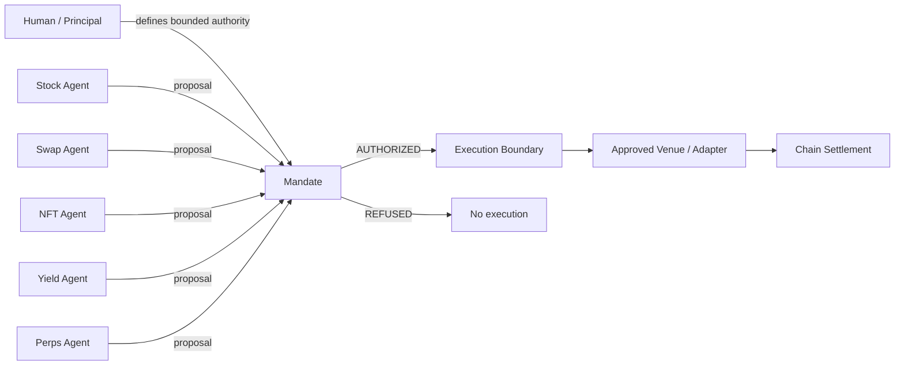

The agent decides **what it wants to do**.

Mandate decides **whether it is allowed to do it**.

The market decides **whether the authorized execution settles**.

---

# The mental model

Mandate separates five concepts that are often mixed together.

### 1. Identity

Who is the principal?  
Who is the agent?

Authentication answers identity. It does not answer economic permission.

### 2. Authority

What may this agent do?

Authority includes:

- capital bounds;
- asset scope;
- representation scope;
- issuer scope;
- venue scope;
- chain scope;
- recipient scope;
- risk limits;
- validity windows;
- execution constraints.

### 3. State

Is the action still valid **now**?

Examples:

- current price;
- quote age;
- trading status;
- representation status;
- corporate-action epoch;
- remaining portfolio capacity;
- outstanding reservations;
- replay state.

### 4. Decision

Does the exact proposed action fit the authority and current state?

This is deterministic.

### 5. Settlement

Only after authorization does an execution adapter interact with the target market or chain.

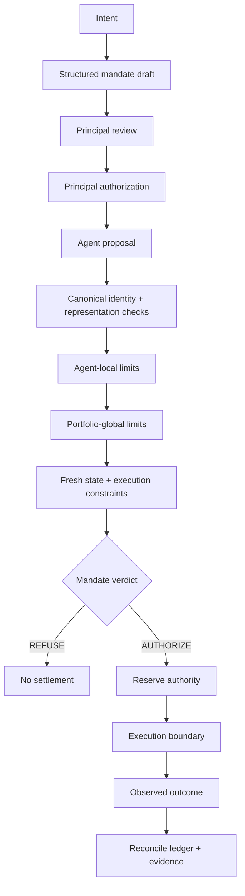

---

# What is implemented

The current repository contains a layered implementation rather than one monolithic agent application.

At a high level:

- deterministic mandate verification;
- canonical asset and representation registry;
- exact routing and economic checks;
- principal-wide authority ledger;
- reservation and replay semantics;
- portfolio-level authority over several agents;
- Live AI agents;
- natural-language mandate drafting;
- wallet-backed mandate approval paths;
- Mandate Room planning and negotiation;
- optional Jev / TypeSafe advisory intelligence;
- policy-stress / firewall demonstration;
- Robinhood Chain testnet execution infrastructure;
- durable live-session and settlement evidence;
- Next.js demo and documentation surfaces;
- Foundry Solidity execution-gate tests;
- adversarial, replay, crash, differential and invariant tests.

The most important separation is:

```text
AI / ranking / negotiation
            |
            v
      proposed action
            |
            v
 deterministic Mandate boundary
            |
     +------+------+
     |             |
  REFUSED       AUTHORIZED
                   |
                   v
              settlement
```

A model being smarter, more confident, or more persuasive does not widen authority.

---

# Quick start

## Requirements

- Node.js `>= 22.18.0`
- npm
- Foundry only if you want to run Solidity tests
- an OpenAI API key only for live-model mode
- a TypeSafe/Jev API key only for live Jev scoring

Clone and install the protocol workspace:

```bash
git clone https://github.com/Maheshsiddu29/Mandate.git
cd Mandate
npm install
```

Install the web app:

```bash
cd apps/web
npm ci
cd ../..
```

## Option A — fastest deterministic demo

Run the offline portfolio demo:

```bash
npm run portfolio:demo
```

Run the deterministic agent stub:

```bash
npm run agents:stub
```

Run the canonical judge transcript:

```bash
npm run demo:judge
```

These paths do not require a model API key.

## Option B — Live AI Lab locally

Create a local `.env` file at the repository root. Never commit it.

```bash
OPENAI_API_KEY=...
OPENAI_MODEL=gpt-5.6-terra

# Optional: enables live Jev/TypeSafe scoring where that path is configured.
TYPESAFE_API_KEY=...
```

`OPENAI_MODEL` is configurable. Setting it explicitly makes the demo reproducible with the model you intend to use.

Start the Live AI API:

```bash
npm run agents:serve
```

By default it binds only to:

```text
http://127.0.0.1:8787
```

Start the web app in another terminal:

```bash
npm --prefix apps/web run dev
```

Open:

```text
http://localhost:3000/demo/live
```

The browser never receives the OpenAI or TypeSafe credential. Model calls are made server-side.

## Option C — local server with settlement integration

For the local V2 settlement composition:

```bash
npm run agents:lab
```

This is intentionally separate from `agents:serve`.

`agents:serve` is the model / Mandate runtime.

`agents:lab` additionally composes the local settlement surface.

Do not run testnet send commands unless you understand the operator authorization flow and are intentionally using the testnet fixture environment.

---

# Demo prompts

Natural language is **draft input**, not authority. Mandate compiles it into structured terms, shows those terms to the principal, and requires explicit authorization.

## 1. Simple single-agent authority

```text
Let the Stock agent manage $800.
```

What this demonstrates:

- only the Stock agent is enabled;
- total capital becomes $800;
- the Stock agent's capital ceiling is $800;
- other agents receive no child authority;
- the model may choose only among Stock candidates that deterministic eligibility code makes actionable;
- the exact proposal is still checked after model selection.

This is the cleanest first demo.

## 2. Dynamic multi-agent allocation

```text
I have $2,000. Let Stock and Yield decide how to split it.
```

What this demonstrates:

- total portfolio authority is $2,000;
- Stock and Yield are enabled;
- the user has deliberately delegated allocation discretion;
- the Planning Room can ask both agents for OpportunityCards;
- agents propose useful allocation ranges;
- optional Jev scores may influence relative weighting;
- the deterministic allocator proposes a split;
- the principal reviews the split before signing;
- unused capital may remain unallocated.

The Room does **not** create authority. It proposes how to use authority the human is considering granting.

## 3. Fixed allocation

```text
$2,000 total. Stock $800, Swap $400, Yield $500, Perps $300.
```

What this demonstrates:

- the human already decided the split;
- there is nothing for the Planning Room to decide;
- each budget becomes an agent-level capital bound;
- agents can use less than their budget;
- unused capital remains with the principal.

Mandate does not force capital deployment.

## 4. Hybrid authority

```text
Give Stock $800 and Yield $400. Let them decide how to use the remaining $800.
```

What this demonstrates:

- part of the allocation is fixed by the principal;
- part is left to agent coordination;
- the Planning Room operates only over the delegated remainder;
- the final plan still requires principal review.

## 5. Complex constraints and an unsupported request

```text
I have $5k. Stock can use $2k, Yield $1k, no perps, Swap can use the remainder, no trade above $500, approved venues only.
```

Mandate should **not silently reinterpret everything**.

The current natural-language layer understands the portfolio/agent/venue parts, but a generic per-trade cap is not automatically invented as a protocol term when the protocol cannot represent it safely.

Expected product behavior:

```text
understood terms      -> structured draft
unsupported term      -> unresolved issue
unresolved issue      -> signing blocked
```

This is deliberate fail-closed behavior.

## 6. Missing authority information

```text
Manage $2,000 conservatively.
```

"Conservatively" is an advisory preference, not authority.

The system should not infer which agents are allowed to use the money.

Expected behavior:

```text
total capital = understood
risk preference = advisory note
agent selection = unresolved
authorization = blocked until principal chooses agents
```

## 7. Portfolio risk constraint

```text
Stock and Perps can use $2k, but Perps max $400, never above 2x leverage, and keep at least half untouched.
```

This demonstrates several independent controls:

- total capital;
- minimum unallocated capital;
- agent-specific maximum;
- derivative exposure;
- leverage;
- agent enablement.

A model cannot treat "2x" as a suggestion. It becomes a deterministic bound.

## 8. Security / firewall demonstration

After a valid run, open **Test the firewall** / Policy Stress.

The important statement is:

```text
VALID AGENT != VALID ACTION
```

The stress agent runs under the same Swap Agent identity but tries preconstructed actions such as:

- unauthorized recipient;
- unauthorized venue;
- unauthorized representation;
- over-limit action;
- compliant control action.

The first four must be refused even though the agent identity itself is valid.

---

# The complete authority model

Mandate treats authority as a hierarchy.

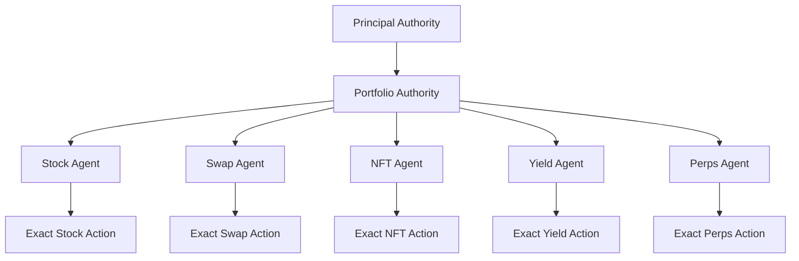

The invariant is:

```text
CHILD AUTHORITY <= PARENT AUTHORITY
```

A child grant may narrow authority.

It may not widen it.

## Portfolio-level controls

The portfolio is where principal-global authority lives.

| Control | Meaning |
| --- | --- |
| Total capital | Principal-declared capital context |
| Maximum deployed | Maximum amount that may be concurrently committed |
| Minimum unallocated | Capital that must remain outside deployment |
| Derivative exposure | Global cap across derivative-consuming agents |
| Illiquid exposure | Global cap for illiquid positions |
| Spot capital | Shared capital dimension for spot-like actions |
| Perp margin | Margin demand tracked as a typed resource |
| Validity window | Authority expires; time never restores it |
| Policy version | Proposals bind to the active policy version |
| Allocation intent | Fixed, dynamic or hybrid allocation semantics |
| Auto-reallocation | Whether released capital may be reassigned inside the signed envelope |

Portfolio authority is global.

That matters because two individually valid agents can still be jointly invalid.

## Agent-level controls

Each enabled agent receives only a subset of the portfolio authority.

Controls include:

- enabled / disabled;
- budget;
- maximum allocation;
- resource hard maxima;
- allowed assets;
- allowed representations;
- allowed issuers;
- allowed venues;
- allowed chains;
- allowed recipients;
- leverage bounds;
- synthetic-exposure policy;
- quote freshness;
- slippage / execution deviation;
- domain/action scope.

Disabled means:

```text
NO AGENT ENTRY
=
NO AUTHORITY
```

## Market-level controls

Mandate distinguishes the financial asset from the token representation.

```text
canonical asset
    |
    +-- representation A
    +-- representation B
    +-- representation C
```

A ticker is not identity.

Mandate separately considers:

- canonical underlying identity;
- representation address;
- issuer;
- backing type;
- synthetic vs backed status;
- redemption terms;
- chain;
- venue;
- protocol;
- rights / representation metadata;
- current representation state.

This is why Mandate can reject a same-name or same-ticker token while accepting another representation of the same economic underlying.

## Execution-level controls

Even after an asset is allowed, the exact execution is bound.

Depending on the domain and execution path, controls include:

- exact candidate identity;
- side;
- quantity;
- maximum debit or minimum receive;
- fee-inclusive economics;
- recipient;
- adapter;
- venue;
- chain;
- deadline;
- quote age;
- slippage;
- representation;
- replay nonce / consumed authorization;
- reservation generation.

The general rule is:

> Authorization belongs to the exact economic action, not merely to the agent that requested it.

---

# Authority commands and human controls

## `AUTHORIZE MANDATE V<n>`

The demonstration-key path requires the exact confirmation string:

```text
AUTHORIZE MANDATE V1
```

An amendment would require:

```text
AUTHORIZE MANDATE V2
```

Case changes, vague confirmation, or the wrong version are refused.

## Wallet approval

The Live Lab also contains wallet-backed EIP-712 approval paths.

The browser may request:

- wallet connection;
- Robinhood Chain testnet network switching;
- EIP-712 typed-data signing.

A typed-data signature is not a blockchain transaction.

```text
wallet signature
!=
transaction
```

and:

```text
portfolio authorization
!=
domain settlement authorization
```

## Adjust Mandate

A signed mandate is not mutated in place.

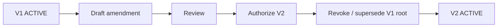

Proposals bound to V1 are not grandfathered into V2.

## Pause

Pause removes active authority rather than silently editing the existing authorization.

A paused / revoked authority must not become valid merely because time passes.

## Automatic reallocation

Automatic reallocation is a separate principal decision.

Default:

```text
autoReallocate = false
```

When false, unused agent budget stays unused.

When true, released capital may be proposed for reassignment, but only inside the signed portfolio and agent bounds and only after complete re-screening.

Reallocation is not authority creation.

## Operator-only testnet send phrase

The local testnet execution scripts use a separate explicit operator confirmation:

```text
AUTHORIZE ROBINHOOD TESTNET SEND
```

This is intentionally not part of the public hosted demo.

---

# AI intelligence layer

AI is used where judgment is useful.

It is deliberately excluded from the final authority decision.

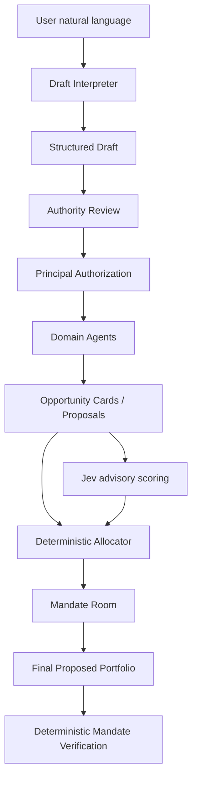

## Draft interpreter

The draft interpreter may map explicit terms and flag ambiguity.

It may not:

- sign;
- activate authority;
- enable an unnamed agent;
- invent missing assets or venues;
- convert a risk preference into new permissions;
- fill a missing safety-critical value with a permissive default.

## Strict model output

Model outputs are constrained by schemas.

A domain model generally returns:

- an offered candidate ID;
- a bounded requested amount;
- `PROPOSE` or `ABSTAIN`;
- a short declared rationale.

The model does **not** get to invent:

- contract addresses;
- arbitrary venues;
- recipients;
- calldata;
- signatures;
- chain IDs;
- new policy fields.

Trusted code performs exact lookup of the selected ID and constructs the real proposal.

## OpportunityCards

Planning uses structured OpportunityCards containing bounded amounts, ordinal metrics, freshness timestamps and evidence labels.

Cards are advisory inputs to allocation.

They are not authorization objects.

## Market research seam

The project has a `MarketResearchProvider` abstraction for point-in-time research.

The current build primarily uses labelled fixture market data and explicitly reports unavailable research categories rather than fabricating them.

---

# Agents

The Live Lab models five domain agents.

| Agent | Role | Typical constraints |
| --- | --- | --- |
| Stock | choose reviewed tokenized-equity exposure | canonical asset, issuer, representation, capital, redemption, chain |
| Swap | choose a route | venue, route, pool, slippage, amount, recipient |
| NFT | choose an acceptable listing or abstain | collection identity, representation, price, illiquid cap |
| Yield | choose a reviewed vault | asset, issuer, protocol, capacity, portfolio limits |
| Perps | choose bounded derivative exposure | leverage, margin, derivative exposure, venue |

Each agent operates under its own child authority.

An agent can be correct according to its objective and still be refused by Mandate.

That is not a failure of the system.

That is the system doing its job.

---

# Mandate Room

The Mandate Room is the coordination layer for multi-agent capital allocation.

The most important property is:

```text
MANDATE ROOM HAS ZERO AUTHORITY
```

The Room can coordinate valid possibilities.

It cannot turn an invalid action into a valid one.

## What the Room may do

Depending on the phase, it may coordinate actions such as:

```text
KEEP
REDUCE
RELEASE
ABSTAIN
```

It can also help propose initial budgets before the principal signs.

## What the Room may never do

It may never:

- create authority;
- enable an agent the principal did not enable;
- raise total capital;
- raise a resource limit;
- widen an agent's child grant;
- approve a new venue;
- approve a new representation;
- change a recipient;
- change candidate identity;
- repair an unauthorized action;
- modify the principal's policy.

## Planning Room

The Planning Room operates **before authorization**.

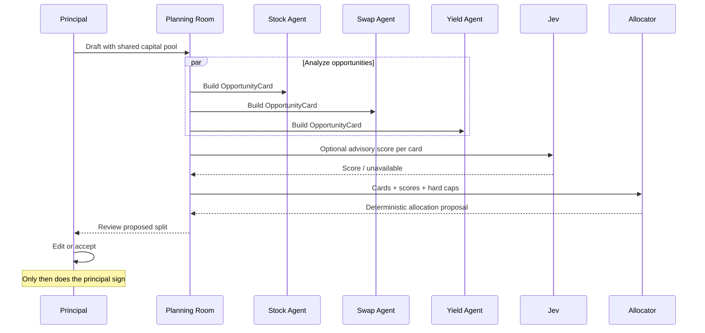

The Planning Room proposal is not authority.

## Fixed / dynamic / hybrid

```text
FIXED
Human supplied every budget.
No Planning Room is needed.

DYNAMIC
Human supplied enabled agents and a shared pool.
Planning Room proposes the split.

HYBRID
Human fixed some budgets and delegated the remainder.
Planning Room only works on the remainder.
```

## Operational shared-resource negotiation

A Room should open only when multiple valid agents are actually competing for the same constrained resource and the principal authorized that coordination.

A single agent exceeding its own limit is a local constraint problem, not a negotiation.

## Reallocation Room

With automatic reallocation enabled, released capital may be proposed for reassignment.

The ledger remains the source of truth for what is actually available.

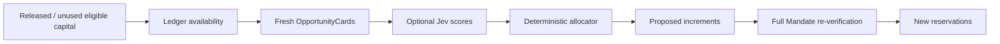

---

# Jev / TypeSafe

Jev is an optional intelligence layer.

Its governing rule is:

```text
Jev may choose.
Jev may abstain.
Jev may fail.
Jev may be wrong.
Jev may be malicious.
Jev may NEVER authorize.
```

## Jev in route selection

The routing integration uses Jev as an advisory selector over a **closed admissible set**.

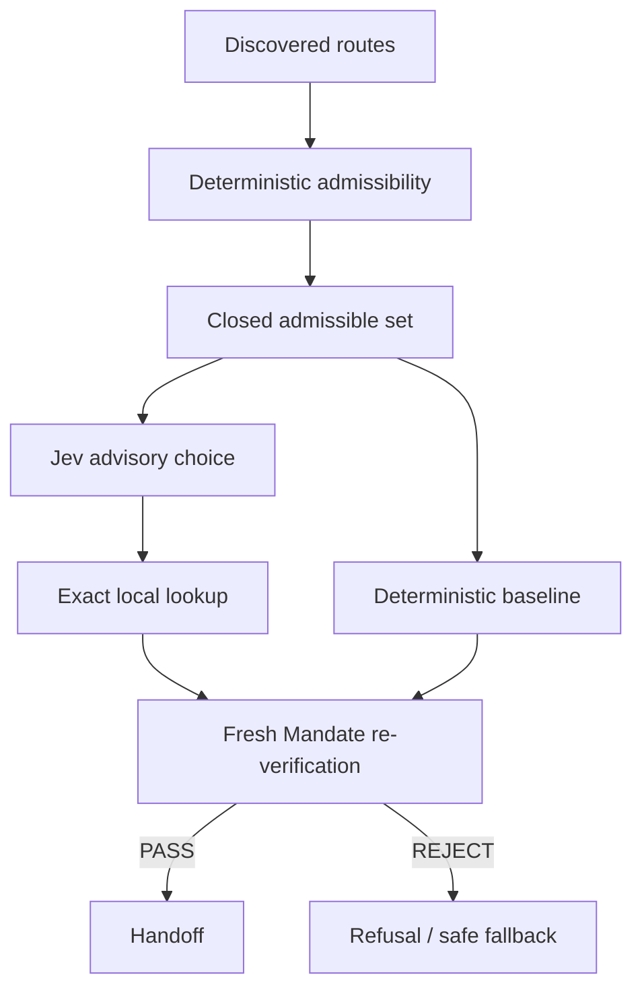

Jev cannot add or mutate an execution candidate.

Failure falls back to deterministic selection.

## Jev in Mandate Room V2

The Room allocation design uses TypeSafe **Score** as an optional score per OpportunityCard.

The score becomes a bounded integer factor used by the deterministic allocator.

A Jev score cannot:

- give capital to an abstaining card;
- exceed the portfolio pool;
- exceed an agent ceiling;
- exceed candidate capacity;
- exceed a resource limit;
- create authority.

If Jev is unavailable, the allocator proceeds without inventing a score.

## Jev secrets

The TypeSafe key is server-side only:

```text
TYPESAFE_API_KEY
```

Do not expose it to the browser.

---

# How a live run works

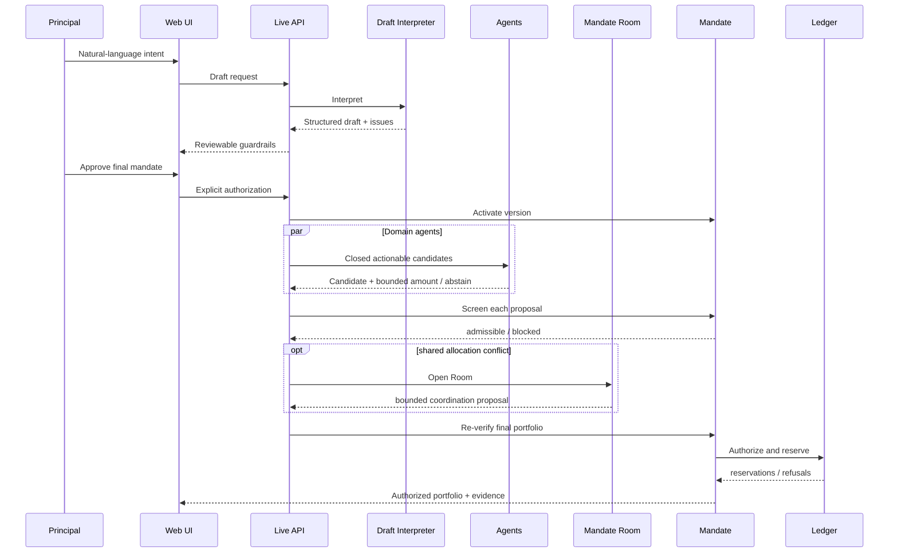

## Candidate pipeline

```text
discovery
   ↓
deterministic eligibility
   ↓
actionable set
   ↓
model selection
   ↓
exact lookup
   ↓
proposal construction
   ↓
full Mandate screening
```

Excluded candidates remain evidence of why they were not actionable.

## Final re-verification

An earlier model decision does not grandfather an execution.

Before handoff, Mandate checks fresh state again.

---

# Execution and settlement

Mandate keeps reasoning and settlement separate.

Reasoning, discovery, ranking, negotiation and most authorization work can happen offchain.

Only an authorized execution needs chain settlement.

## Execution gate

The Solidity execution gate is the onchain enforcement boundary for the supported EVM fixture path.

It binds the principal mandate, signatures, candidate commitment, exact economics, recipient, supported market and replay state.

## Robinhood Chain testnet evidence

The current repository documents this fixture deployment:

```text
Network: Robinhood Chain Testnet
Chain ID: 46630

MandateExecutionGate:
0xb03c1e072192a82ba68604841a0e42f32609aa3e

FixtureVenue:
0x850be07c638ae221c35433eaac71a8c8720de504

FixtureVenueAdapter:
0x88c966c644208f3a0e75ef929169a7e06084e969

MDEMO:
0x5d4c3618f996777baf0e0468884bb7a440f189e1

MDUSD:
0x53b640b9a573e33c541de5a4917bc4d28d956abf
```

These are **valueless labelled fixtures**.

They are not an NVDA trade.

They are not a Robinhood Stock Token.

## Replay protection

Reservations exist before signing/execution so concurrent attempts cannot independently spend the same capacity.

```text
authority available
      ↓
reservation
      ↓
attempt admitted
      ↓
execution / observed outcome
      ↓
reconciliation
      ↓
consumed / released / held
```

Unknown outcome is not automatically treated as free capacity.

---

# Security model

## Fail closed

Unknown mandatory data is a refusal.

## Models are advisory

No model is part of the deterministic verifier dependency graph.

## Prompt-injection containment

Third-party candidate text is data, not authority-bearing instruction.

## Principal-global accounting

Agent permissions are local. Portfolio authority is global.

## Exact arithmetic

Safety-critical economics are represented exactly, with units and decimals.

## Time is explicit

Safety-critical verification receives time as an input.

## Passage of time does not restore authority

Observed outcome and reconciliation determine whether capacity is consumed, held or released.

## Public-demo server cannot settle

The hosted Live API has an explicit mode:

```text
MANDATE_PUBLIC_DEMO=1
```

In that mode:

- the server may bind to `0.0.0.0`;
- Railway's `PORT` is honored;
- CORS uses one exact HTTPS origin;
- public sessions are memory-only;
- local `.live` state is not loaded;
- settlement extension attachment is refused with:

```text
PUBLIC_DEMO_WRITE_DISABLED
```

The public server should not hold principal, wallet, deployer or production signing keys.

---

# Evidence classes

| Evidence | Meaning |
| --- | --- |
| `FIXTURE` | engineered / committed market data |
| `LIVE_MODEL` | a real model produced the inference |
| `STUB` | deterministic stub model |
| `SCRIPTED` | scripted test/provider response |
| `LIVE_JEV` | a live TypeSafe/Jev response was used |
| `JEV_UNAVAILABLE` | Jev was unavailable and no score was fabricated |
| `DATA_UNAVAILABLE` | requested research data did not exist |
| `LIVE_TESTNET` | confirmed testnet settlement evidence |
| `OFFCHAIN_ONLY` | authorization/decision evidence without settlement |

```text
LIVE_MODEL != LIVE_MARKET_DATA
LIVE_MODEL != LIVE_TESTNET
AUTHORIZED != SETTLED
```

---

# Architecture

## System architecture

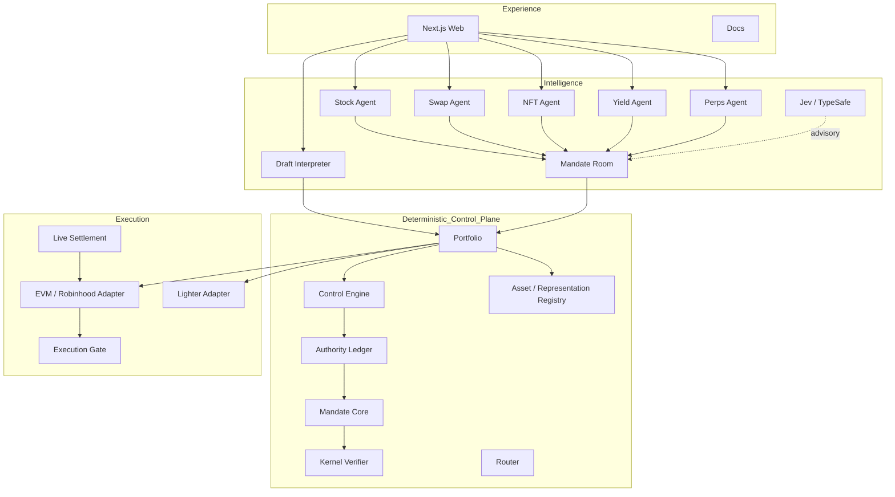

## Dependency philosophy

```text
kernel
  ↑
core
  ↑
ledger
  ↑
control
  ↑
portfolio
  ↑
live-agents
  ↑
presentation / composition
```

AI code is above the authority core.

The authority core does not import the AI layer.

## Live API architecture

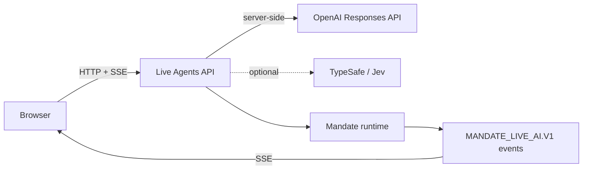

---

# Repository map

```text
Mandate/
├── contracts/
│   ├── src/
│   └── test/
├── packages/
│   ├── kernel/
│   ├── registry/
│   ├── router/
│   ├── jev/
│   ├── execution-gate/
│   ├── core/
│   ├── ledger/
│   ├── ledger-sqlite/
│   ├── control/
│   ├── perp-lighter/
│   ├── evm-robinhood/
│   ├── portfolio/
│   ├── judge-demo/
│   ├── live-agents/
│   └── live-settlement/
├── apps/
│   └── web/
├── docs/
├── corpus/
└── scripts/
```

---

# Commands

## Core validation

```bash
npm run typecheck
npm test
npm run check
```

## Repository safety

```bash
npm run credentials:scan
npm run repository:junk
npm run audit:security
```

## Offline demos

```bash
npm run portfolio:demo
npm run demo:judge
npm run demo:judge:json
npm run agents:stub
```

## Live AI

```bash
npm run agents:live
npm run agents:live:json
npm run agents:serve
```

## Jev

```bash
npm run jev:fixtures:validate
npm run jev:evaluate
npm run jev:benchmark
TYPESAFE_API_KEY=... npm run jev:characterize
```

## Web

```bash
npm --prefix apps/web run dev
npm --prefix apps/web run check
npm --prefix apps/web run build
```

## Solidity

```bash
npm run contracts:fmt
npm run contracts:build
npm run contracts:lint
npm run contracts:test
npm run contracts:slither
```

## Robinhood Chain testnet read-only / dry-run

```bash
npm run robinhood:testnet:verify
npm run agents:rpc:smoke
npm run agents:live:testnet:dry-run
```

---

# Deployment

## Web

Current public URL:

```text
https://mandateai.vercel.app
```

The static Protocol Replay does not need API secrets.

## Railway Live API

Start Command:

```text
npm start
```

Railway variables:

```text
MANDATE_PUBLIC_DEMO=1
MANDATE_ALLOWED_ORIGIN=https://mandateai.vercel.app

OPENAI_API_KEY=...
OPENAI_MODEL=gpt-5.6-terra

# optional
TYPESAFE_API_KEY=...
```

Railway supplies `PORT`.

Health endpoint:

```text
GET /health
```

Expected response:

```json
{
  "ok": true,
  "service": "mandate-live-api"
}
```

### Current browser-client boundary

At the time of this README draft, the committed browser client still validates the Live API as a loopback HTTP endpoint.

The Railway backend can therefore be hosted safely, but `/demo/live` on Vercel still needs the corresponding reviewed frontend change that permits **one exact configured HTTPS API origin**.

Do not remove URL validation entirely.

The safe design is:

```text
localhost development
OR
one build-time configured HTTPS Mandate API origin

never
arbitrary user-controlled remote URLs
```

---

# Testing

Mandate treats refusal paths as product behavior, not edge cases.

The test strategy includes:

- unit tests;
- deterministic decision vectors;
- property tests;
- fuzz tests;
- Solidity invariant tests;
- TypeScript/Solidity differential tests;
- adversarial model tests;
- prompt-injection tests;
- replay tests;
- authority-subset tests;
- portfolio-global capacity tests;
- crash/restart reconciliation tests;
- secret scanning;
- dependency-boundary tests;
- generated-artifact drift checks.

> A feature is not complete until its failure modes are tested.

---

# Known limitations

- Live AI Lab market data is largely fixture data.
- Live-model inference does not imply live market data.
- Research categories not currently available are explicitly reported unavailable.
- Reasoning coverage is broader than network settlement coverage.
- Robinhood Chain execution evidence uses valueless fixture assets.
- The public hosted API intentionally disables blockchain writes.
- Production custody, authenticated multi-tenant settlement, HSM/MPC signing and replicated production state require a stronger operational boundary.

---

# Design principles

### Agents decide. Mandate defines what they are allowed to do.

Agent intelligence and agent authority are separate concerns.

### A valid signature is authentication, not authorization.

The exact action still has to fit the principal's policy.

### Agent permissions are local. Portfolio authority is global.

Independent agents share one principal's economic capacity.

### Canonical asset identity is not a ticker.

A representation must be resolved and checked, not guessed from a symbol.

### Unknown mandatory data fails closed.

Uncertainty does not become permission.

### Models may influence preference, never authority.

OpenAI and Jev can help choose among bounded possibilities. They cannot enlarge the possible set.

### The Room coordinates. It does not authorize.

Negotiation cannot repair a policy violation.

### Reasoning is offchain. Settlement is the expensive boundary.

Discovery, ranking, planning and negotiation do not need a blockchain transaction.

### Evidence must say what it actually proves.

`LIVE_MODEL`, `FIXTURE`, `OFFCHAIN_ONLY` and `LIVE_TESTNET` are different claims.

---

# Further reading

- [`docs/mandate-design.md`](docs/mandate-design.md) — canonical design
- [`docs/architecture.md`](docs/architecture.md) — system architecture
- [`docs/phase-7f/portfolio-mandate.md`](docs/phase-7f/portfolio-mandate.md) — portfolio authority
- [`docs/demo/live-ai-lab.md`](docs/demo/live-ai-lab.md) — Live AI Lab
- [`docs/v2/mandate-room-v2.md`](docs/v2/mandate-room-v2.md) — planning, allocation and negotiation
- [`docs/jev-integration.md`](docs/jev-integration.md) — Jev authority boundary
- [`docs/execution-gate.md`](docs/execution-gate.md) — onchain execution gate
- [`docs/demo/wallet-settlement-boundaries.md`](docs/demo/wallet-settlement-boundaries.md) — wallet and settlement trust boundaries
- [`docs/phase-7e/robinhood-demo.md`](docs/phase-7e/robinhood-demo.md) — Robinhood Chain testnet evidence
- [`AGENTS.md`](AGENTS.md) — repository engineering and security rules

---

# Summary

Mandate is not another agent wallet, router or strategy engine.

It is the layer between autonomous decision-making and irreversible financial execution.

```text
Human authorizes once.
Agents act within it.
Mandate verifies every action.
```

> **Autonomous agents should be free to reason, compete and negotiate — but never free to invent their own authority.**
